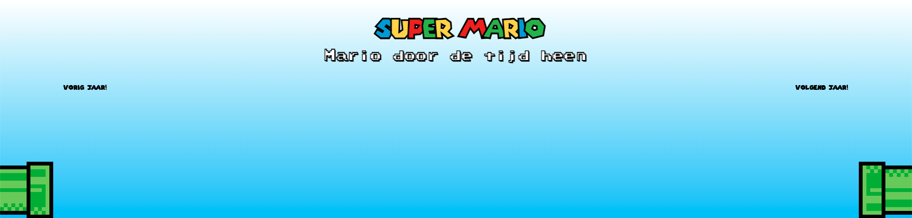
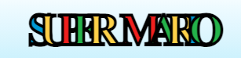
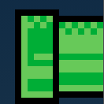
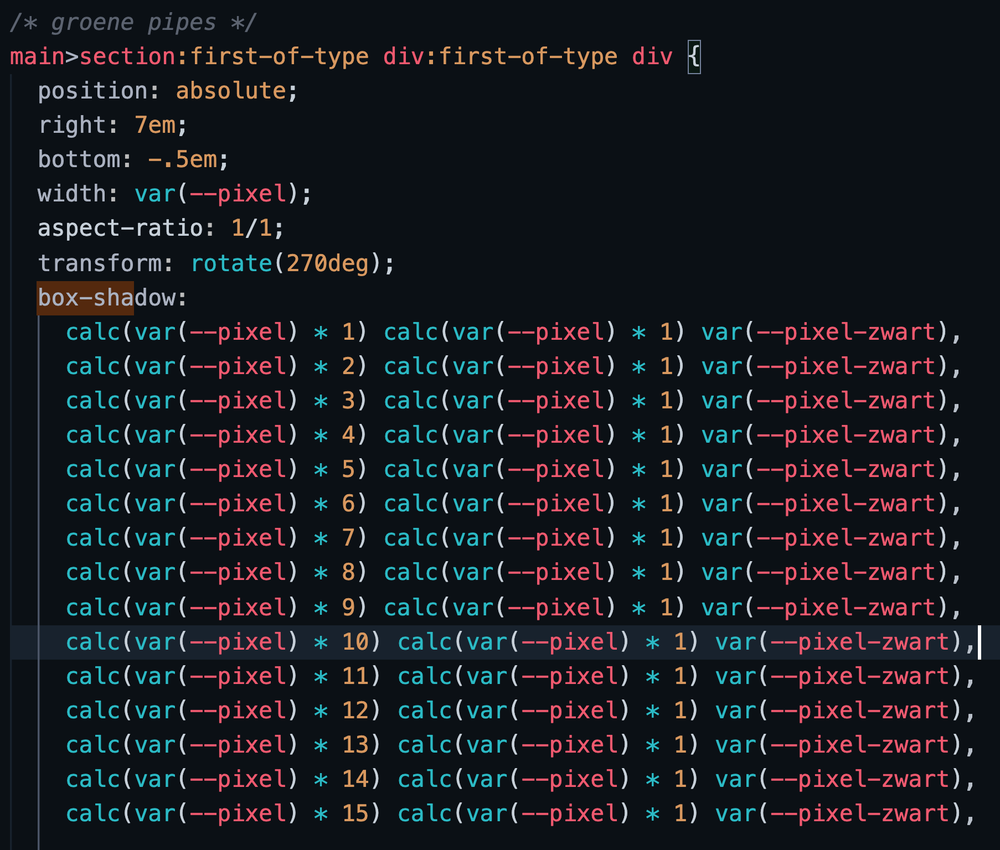
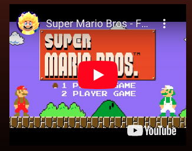
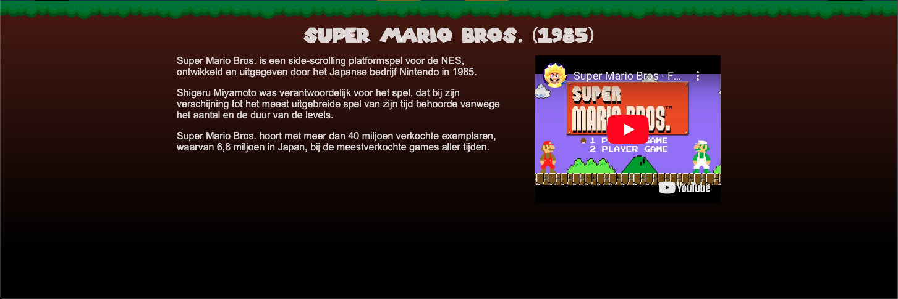

# Procesverslag
Markdown is een simpele manier om HTML te schrijven.  
Markdown cheat cheet: [Hulp bij het schrijven van Markdown](https://github.com/adam-p/markdown-here/wiki/Markdown-Cheatsheet).

Nb. De standaardstructuur en de spartaanse opmaak van de README.md zijn helemaal prima. Het gaat om de inhoud van je procesverslag. Besteedt de tijd voor pracht en praal aan je website.

Nb. Door *open* toe te voegen aan een *details* element kun je deze standaard open zetten. Fijn om dat steeds voor de relevante stuk(ken) te doen.

## Jij

### Ontwerper:
Rens Westerveld

#### Je startniveau:
Mijn startniveau is: Rood

# Je plan

  
De eerste versie/schets van je ontwerp & je persoonlijke uitdaging

  ### De eerste versie/schets:
  

  ### Je ambitie: 
  Aan deze technieken/punten wil ik werken:
  - Javascript
  - Responsive
  - Slimme dingen zoals Calc() en --root
  - Animaties
 

## Voortgang/Feedback 1

  
Mijn bevindingen + wijzigingen (minimaal 5)

  ### Bevinding 1:
  Voeren van shrooms om "verder" te komen is een goed idee.

  #### oplossing:
  -

  ### Bevinding 2:
  Hoe ga je de achtergrond laten veranderen bij de horizontal scroll? Wat is hier de beste manie om dit te doen? foto's achter elkaar?

  #### oplossing:
  Alle Images achter elkaar plakken en op de overgang tussen de images/werelden een element die over mario heeft komt om hem daar achter te veranderen

  ### Bevinding 3:
  Hoe ga je mario veranderen? transitie?

  #### oplossing:
  Als ik idee 1 kies, dan het bovenstaande (bevinding 2) en anders door een leuke animatie die past bij het verder gaan en terug gaan. (voeren van mushrooms met de vergroot animatie en terug gaan door te raken met een "shell")

  ### Bevinding 4:
  Probeer het uniek voor mario te maken. Nu kunnen ook ander karakters in die plaats.

  #### oplossing:
  Ik heb voor "idee 3" gekozen. Dit is echt uniek en herkenbaar voor mario. Ik heb hier herkenbare animaties aan toegevoegd zodat het goed binnen de vormgeving valt.

  ### Bevinding 5:
  Je kan idee 1 en 3 combineren (Lopen door het level en het voeren van Mushrooms om verder te komen)

  #### oplossing:
  -

## Voortgang/Feedback 2

  
Mijn bevindingen + wijzigingen (minimaal 5)

  
  ### Bevinding 1:
  Nog geen bronnen bij de afbeeldingen.

  #### oplossing:
  Bronnen van de gebruikte afbeeldingen terug gaan zoeken en in de code zetten.

  ### Bevinding 2:
  IMG's laden niet in op github.
  

  ### oplossing:
  bij de 'src' ./ gebruiken ipv /

  ### Bevinding 3:
  Font van mario wordt niet getoond op github.
  

  #### oplossing:
  Kijken waarom het font niet wordt ingeladen. Is dit door github of omdat het font niet goed opgehaald wordt.

  ### Bevinding 4:
  CSS selectors staan op willekeurige volgorde.

  ### oplossing:
  Kijken of ik structuur kan aanbrengen in mijn CSS selectors.

  ### Bevinding 5:
  Er zijn nog weinig states toegevoegd

  ### oplossing:
  States gaan toevoegen aan de buttons.

  ### Bevinding 6:
  Nog geen aandacht gegeven aan dark mode en reduced motion

  ### oplossing:
  Deze gaan toevoegen.

## Voortgang/Feedback 3

  
Mijn bevindingen + wijzigingen (minimaal 5)

  
  ### Bevinding 1:
  Onderkant mooier maken

  #### oplossing:
  Beschrijving hoe je het hebt hebt opgelost of als het niet gelukt is hoe je het zou oplossen (tekst en afbeeding(en)).

  ### Bevinding 2:
  Leuke elementen toevoegen

  #### oplossing:
  Beschrijving hoe je het hebt hebt opgelost of als het niet gelukt is hoe je het zou oplossen (tekst en afbeeding(en)).

  ### Bevinding 3:
  Kijken naar cursor dat die anders is op andere devices

## Reflectie

  
Mijn eindresultaat & persoonlijke ontwikkeling

  ### Je uitkomst - karakteristiek screenshot(s):
  
   

  ### Dit ging goed/Heb ik geleerd: 
  Korte omschrijving met plaatje(s)

  Ik heb geleerd dat ik eerst een plan moet maken met waar welke elementen moeten komen voordat ik begin met coderen. Nu was ik gewoon maar begonnen met een basis idee en ben ik daar verder op gaan bouwen met nieuwe ideetjes.

  Ik heb geleerd hoe ik "pixel art" kan maken met box shadows en hoe ik hierbij ook kan rekenen met variabelen zodat deze allemaal makkelijk aan te passen zijn.
  
  

  Beginnen met Javascript ging voor mijn niveau wel goed. Ik wist de basis op te zetten voor de functies die ik uit wilde gaan voeren. Alleen de complexere dingen had ik hulp bij nodig, maar begrijp ik wel en dacht ik bij mee tijdens de hulp. Ik heb zelfs zelfstandig Javascript code gemaakt die ik voorheen niet zou kunnen.

  Experimenteren met elementen waar ik nog nooit mee heb gewerkt. zoals een iframe.
  

  

  ### Dit was lastig/Is niet gelukt:
  Korte omschrijving met plaatje(s)
  
  Een custom cursor toevoegen wanneer je over een button heen hovert.

  Timing van het verbergen van de button, mijn code brak wanneer ik hiermee aan de slag ging en kwam door de tijd hier niet meer uit.

  Ik ben nog niet helemaal tevreden met de vormgeving. Ik had nog graag leuke/grappige elemeten toe willen voegen aan de pagina en de onderkant (waar de tekst staat) nog wat mooier willen vormgeven.
  

## Bronnenlijst

continu bijhouden terwijl je werkt

1. https://mario.fandom.com/fi/wiki/Koopa_Shell
2. https://www.pngwing.com/en/free-png-yfwzy
3. https://my-miis.fandom.com/wiki/SMB2_Mario
4. https://www.clipartmax.com/middle/m2i8d3A0A0K9i8b1_super-mario-advance-pixel-pals-super-mario-mario/
5. https://www.pngkey.com/pngs/super-mario-world/
6. https://www.pngitem.com/middle/iRxmTiR_super-mario-64-mario-png-super-mario-64/
7. https://www.pngwing.com/en/free-png-pgvrg
8. https://nl.pinterest.com/pin/703335666810051480/
9. https://mario.fandom.com/nl/wiki/Mario
10. https://nl.pinterest.com/pin/260575528417484918/
11. https://www.pngwing.com/en/free-png-peovf
12. https://www.creativebloq.com/news/mario-movie-body

